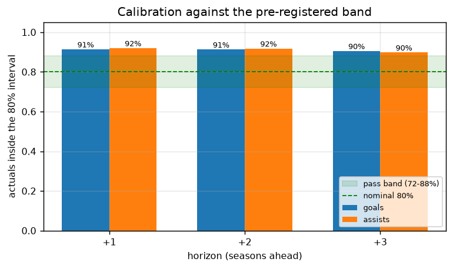
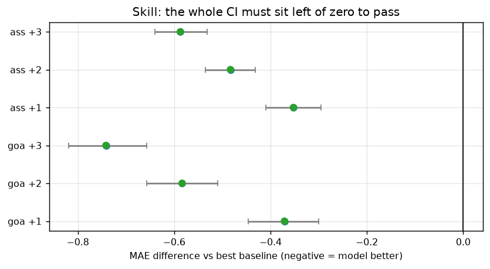

# Football Trajectory: can you project a teenager's career?

[](https://github.com/aleks-drozy/football-trajectory/actions/workflows/tests.yml)

**▶ Live explorer: [aleks-drozy.github.io/football-trajectory](https://aleks-drozy.github.io/football-trajectory/)**: 16 young players, projection fans, and seven legend arcs to compare against.

**⏳ [Predictions ledger](PREDICTIONS.md)**: the model's 2026-27 calls, frozen 2026-07-17, scored publicly when the season ends.

If Lamine Yamal keeps performing the way he has, how many goals will he finish
with? The tempting answer is to resample his own three seasons ten thousand
times and publish the fan chart. It would look authoritative and mean almost
nothing: a tiny sample, an assumption that his current rate *is* his true rate,
no aging, and no way of ever being wrong.

So this asks the question behind it: **can cohort-based aging curves plus Monte
Carlo produce _calibrated_ projections that beat naive baselines out-of-sample?**
Built on **24,057 FBref Big-5 player-seasons** (2017-18 .. 2025-26), against a
gate committed to git (`c0a6260`, **2026-07-16**) **before any modelling code
existed**.

## Verdict: NOT PROVEN at all six gates, and it fails the interesting way

| | goals +1 | goals +2 | goals +3 | assists +1 | assists +2 | assists +3 |
|---|---|---|---|---|---|---|
| **Calibration** (80% interval must cover 72-88%) | 91.5% ✗ | 91.2% ✗ | 90.4% ✗ | 92.2% ✗ | 91.8% ✗ | 89.4% ✗ |
| **Skill** (beat best baseline, CI excluding 0) | ✓ | ✓ | ✓ | ✓ | ✓ | ✓ |
| **Concentration** (survive leave-one-group-out) | ✓ 0/9 | ✓ 0/9 | ✓ 0/9 | ✓ 0/9 | ✓ 0/9 | ✓ 0/9 |

**The skill is real and broad.** At +3 seasons the model's MAE is **1.093 vs the
best baseline's 1.805** (diff −0.712, 95% CI [−0.792, −0.626]), and dropping any
single league or position never flips it: 0 of 9 leave-one-group-out checks
fail, at every horizon. The advantage *grows* with horizon, which is what a real
aging model should do: "he'll repeat last season" decays, a model that knows how
players age does not.

**But the uncertainty is not honest, and it fails the unusual way.** The nominal
80% interval catches ~90-92% of outcomes: the model is **under-confident**, not
over-confident. Almost every projection system in this genre fails by being too
narrow. This one is too wide.

> **Useful point projections. Untrustworthy intervals.**

So the Yamal chart ships labelled **NOT TRUSTWORTHY**, as the pre-registration
requires. A well-drawn interval that isn't calibrated is a lie with error bars.

| The failure, visibly | The skill, visibly |
|---|---|
|  |  |

**The other headline number: K = 110** (fitted, not chosen). The shrinkage
constant is in units of 90s, so 110 ≈ 9,900 minutes ≈ **3.5 full seasons** of
play before a player's own record outweighs the cohort prior. That is the real
answer to "how much should we believe Yamal's 0.52 npg/90 at 18?"

Full method, data-quality findings, and limitations: **[WRITEUP.md](WRITEUP.md)**.
The pre-registration and its amendment log: **[DESIGN.md](DESIGN.md)**.
New here? **[HOW_TO_READ_THIS.md](HOW_TO_READ_THIS.md)** is a guided path through
the repo.

This is a research project, not a scouting tool.

## Methodology at a glance

- **Pre-registered.** Gates, thresholds, baselines and test seasons were
  committed on **2026-07-16** (`c0a6260`) before any modelling code existed;
  every later change is logged in [DESIGN.md](DESIGN.md)'s amendment section.
- **Three-part gate, six horizons.** Calibration (nominal 80% interval must
  cover 72-88%), skill (beat the best naive baseline with a bootstrap CI
  excluding zero) and concentration (survive every leave-one-league/position-out
  check), judged at goals/assists × +1/+2/+3 seasons.
- **Unseen-season replication.** v2 was evaluated with `run_validate.py --fresh`
  on 2025-26, a season never touched during development. Same result as the
  original split: real skill, too-wide intervals (see below).
- **Verdict: NOT PROVEN at all six gates**: the model beats every baseline
  everywhere, but its intervals are under-confident, so projections ship
  labelled exactly as trustworthy as the validation earned.

## v2: availability now conditions on talent

The v1 results made one flaw obvious: the availability model conditioned on
(minutes, age) and **never on talent**, so a generational teenager inherited the
dropout hazard of the *average* teenager with similar minutes. That, not
finishing, was driving every projection.

v2 adds a talent tercile (attacking output/90, absolute cut points within
position, carried forward from the last qualifying season, never read from the
future). For a Yamal-like state it moves median career minutes **9,794 →
14,939** and P(still in the Big-5 at 30) from **0.25 → 0.43**, and it improves
inner-split MAE **1.3574 → 1.3407**: clean, leak-free evidence that it helps.

**One caveat, enforced in the output files.** v2 was built *after* seeing the v1
gate, so re-running the same 2022-24 split is a **second look at a spent test
set**: `results/gate.json` says so in `test_status`. Season 2025-26 was never
used to evaluate anything, so `run_validate.py --fresh` tests v2 on it alone:
`results/gate_fresh.json`, `test_status: "CLEAN"`. **That is the v2 number to
quote.**

### And it replicates on unseen data

The clean 2025-26 test (1,959 players, one horizon):

| | calibration | skill | concentration | verdict |
|---|---|---|---|---|
| goals +1 | 92.2% ✗ | MAE **1.248** vs persistence 1.633, diff −0.386 [−0.459, −0.315] ✓ | 0/9 ✓ | NOT PROVEN |
| assists +1 | 92.2% ✗ | MAE **1.040** vs cohort mean 1.376, diff −0.336 [−0.384, −0.287] ✓ | 0/9 ✓ | NOT PROVEN |

Different base season, different test season, near-identical numbers to v1's
2022 split (cal 91.5%, MAE 1.279 vs 1.642, diff −0.363). **"Useful point
projections, untrustworthy intervals" is not an artefact of one split**: it
survived a clean replication, which is the strongest claim this project makes.

## The interactive explorer

`viz/trajectory_explorer.html` is a self-contained page (open it in any browser,
data embedded, no server needed): pick any of 16 young attackers, see the
projected fan of goals / assists / minutes from now to age 38, and, in the
career view, graft a legend's real arc onto them with the **"Compare with"**
selector: Messi, Cristiano Ronaldo, Mbappé, Haaland, Benzema, Agüero or Rooney,
each built from their actual season-by-season league record (all verified
against FBref; Messi's sums to exactly his 474 record, Rooney's to exactly his
208). Two modes per pair (*at their rate* and *improving like them*), with the
second suppressed wherever the growth factor cannot honestly be transplanted.
Arcs belonging to still-active players (Mbappé, Haaland) are labelled as still
being written. The fan says what usually happens; the gold dashed line says
what following one of the greatest careers ever would look like. The page
carries the model's honest verdict on itself either way.

Rebuild after re-running the pipeline:

```bash
python scripts/export_trajectories.py    # per-season bands  -> results/trajectories.json
python scripts/legend_scenarios.py       # legend arcs       -> results/legend_scenarios.json
python scripts/build_viz.py              # inject into viz/template.html -> the page
```

## Quick start

```bash
python -m venv .venv && .venv/Scripts/pip install -r requirements.txt
python -m pytest                             # 95 tests, no network

python scripts/fetch_data.py                 # -> data/raw/*.parquet (drives headless Chrome; slow)
python run_validate.py                       # -> results/gate.json          (the verdict)
python run_project.py                        # -> results/projections.json   (needs gate.json)
python scripts/diagnose_calibration.py       # -> results/calibration_diagnostic.json
python scripts/make_charts.py                # -> charts/*.png
```

`run_project.py` refuses to run without a verdict: projections only ship with
the trust label the validation actually earned.

## How it works

- **Talent: Gamma-Poisson shrinkage.** `(Σ w·events + K·prior) / (Σ w·n90 + K)`.
  `K` is grid-searched against out-of-sample error, because hand-picking it is
  the quiet cheat in this genre: it's the one knob deciding whether a hot
  teenage sample gets believed. The formula is exactly a conjugate posterior
  *mean*, so the same fitted `K` also gives principled uncertainty that narrows
  as a career accumulates.
- **Aging: delta method, per position, two variants.** The method's known flaw
  is survivor bias: players who decline lose their place and never supply their
  next delta. A `dropouts` variant re-enters vanished players at replacement
  level; the choice between it and `survivors` is made on an **inner split**,
  never the test seasons.
- **Minutes: non-parametric.** Sampled from empirical transitions given
  (minutes bucket, age bucket). Zero is a real outcome, so injury, benching and
  leaving the Big-5 need no separate model. The fitted model knows 84% of
  players who leave the Big-5 stay gone.
- **Monte Carlo: four separate uncertainty sources:** talent posterior,
  availability, Poisson event noise, and a bootstrap ensemble of aging curves.

## Scope boundary

Big-5 **domestic league** output only. A move to Saudi/MLS/Eredivisie leaves the
data and reads as zero minutes: a modelling boundary, not a retirement
prediction. Cups and Champions League are not counted, so record comparisons are
league-only (Messi's 474 La Liga, Shearer's 260 Premier League) and use total
goals, since published records count penalties.

## Project structure

```
football-trajectory/
├── DESIGN.md            # PRE-REGISTRATION (committed before any modelling) + amendment log
├── WRITEUP.md           # method, results, honest verdict, limitations
├── data/
│   ├── schema.py        # canonical columns, identity threshold
│   └── loader.py        # raw -> panel; transfer aggregation, league repair, identity audit
├── model/
│   ├── aging.py         # delta-method curves (survivors | dropouts)
│   ├── talent.py        # Gamma-Poisson shrinkage, fit_K
│   └── minutes.py       # empirical availability transitions
├── mc/
│   ├── simulate.py      # career paths, bootstrap curve ensemble
│   └── records.py       # sourced thresholds; refuses truncated careers
├── validation/
│   ├── backtest.py      # leak-safe fit + project
│   ├── baselines.py     # persistence, cohort mean
│   └── gate.py          # calibration, skill, concentration
├── scripts/             # fetch_data, diagnose_calibration, make_charts
├── tests/               # 95 tests, no network
├── run_validate.py      # the gate
└── run_project.py       # projections, labelled by the verdict
```

## Data quality notes

Two findings worth knowing if you reuse this data:

- **soccerdata returns a null league for every Bundesliga row** in the Big-5
  Combined view (4,330 rows, 18% of the panel). `repair_missing_league` infers
  it and verifies its own premise (four of five labels present ⇒ the rest is the
  fifth), raising rather than guessing if that breaks. Left unfixed, the
  Bundesliga is invisible to the concentration check.
- **`(name, born_year)` is the only available identity key** and it does collide:
  two Portuguese players named **Vitinha, both born 2000**, merge into one row of
  4,345 minutes, more than a human can play. `audit_identity` catches it by that
  signature. Rate: 1 in 24,057 (0.004%), and that's a **lower bound**.
